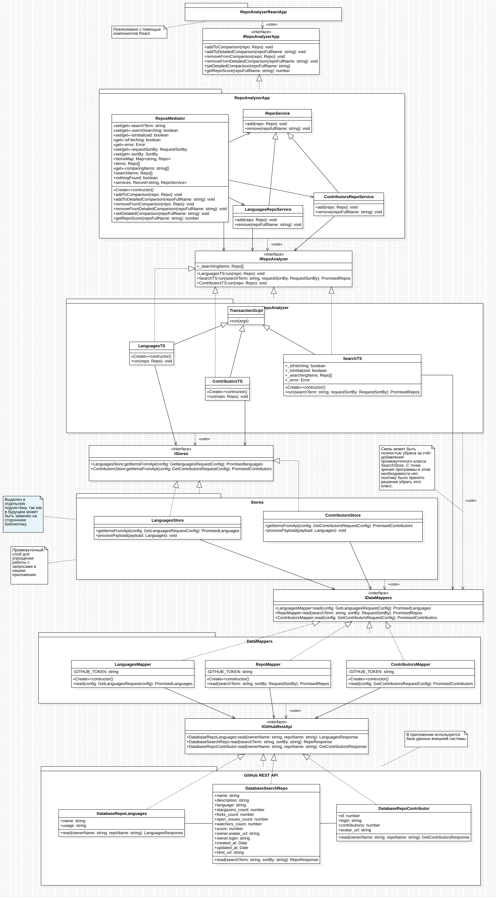
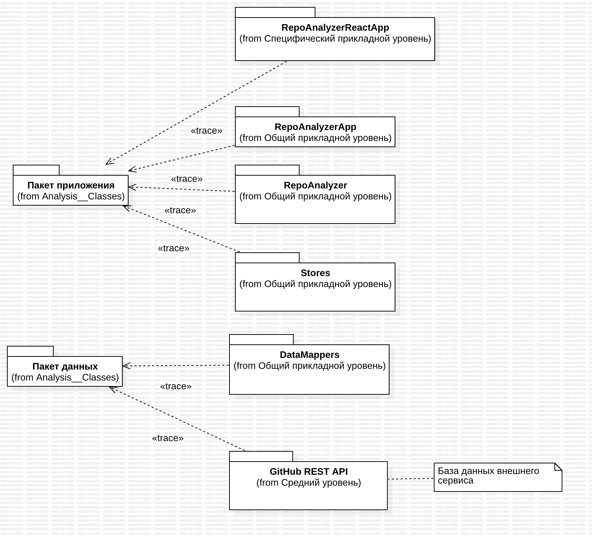
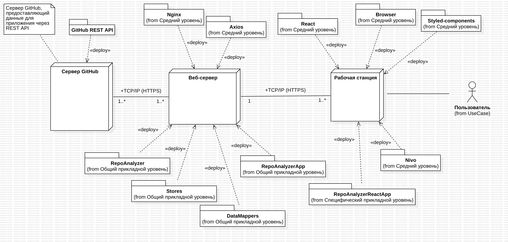
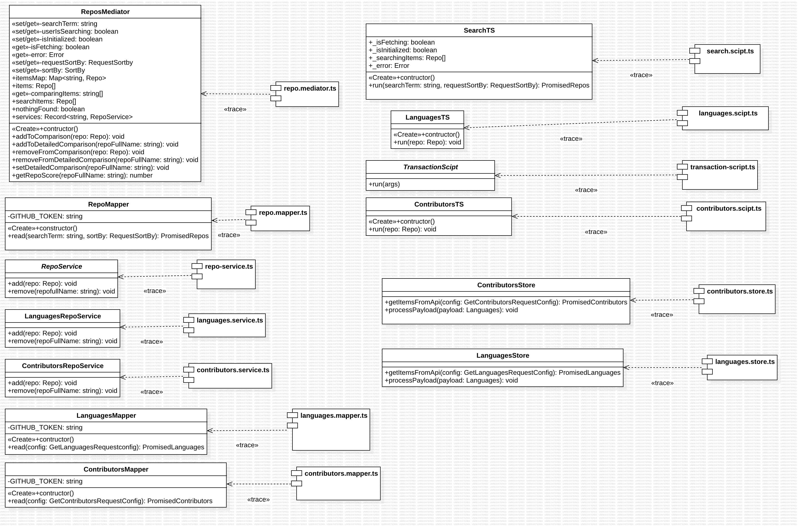
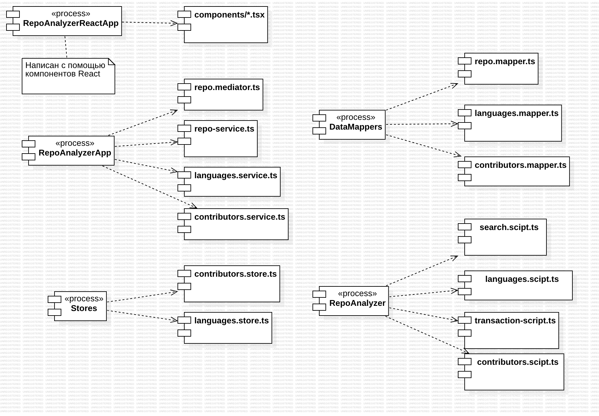
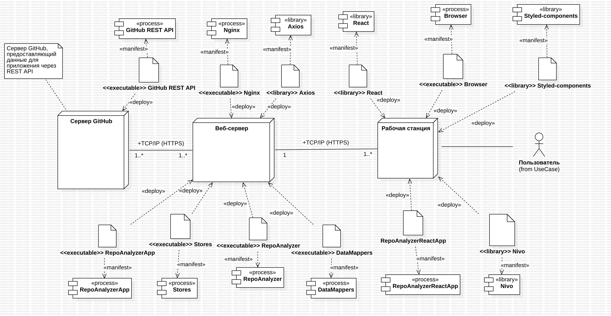

# Отчёт Пакало А.С. ИУ5-12М по Домашнему заданию №3

## Диаграмма пакетов анализа

Рис. 1 - Диаграмма пакетов анализа

## Диаграмма классов и последовательностей

Рис. 2 - Диаграмма классов

Рис. 3 - Диаграмма последовательностей для прецедента поиск

Рис. 4 - Диаграмма последовательностей

## Диаграмма распределения классов проектирования по подсистемам

Рис. 5 - Диаграмма распределения классов проектирования по подсистемам

Рис. 6 - Диаграмма распределения классов проектирования по подсистемам
с интерфейсами подсистем

## Диаграмма уровней подсистем

Рис. 7 - Диаграмма уровней подсистем

## Модель трассировки пакетов анализа в подсистемы

Рис. 8 - Модель трассировки пакетов анализа в подсистемы

## Модель трассировки классов анализа в подсистемы

Рис. 9 - Модель трассировки классов анализа в подсистемы

## Диаграмма развёртывания

Рис. 10 - Диаграмма развёртывания подсистем

## Модель трассировки подсистем в компоненты

Рис. 11 - Модель трассировки подсистем в компоненты

## Модель трассировки классов проектирования в исходные файлы

Рис. 12 - Модель трассировки классов проектирования в исходные файлы

## Модель зависимостей компонентов от исходных файлов

Рис. 13 - Модель зависимостей компонентов от исходных файлов

## Диаграмма развёртывания с компонентами

Рис. 14 - Диаграмма развёртывания с компонентами
