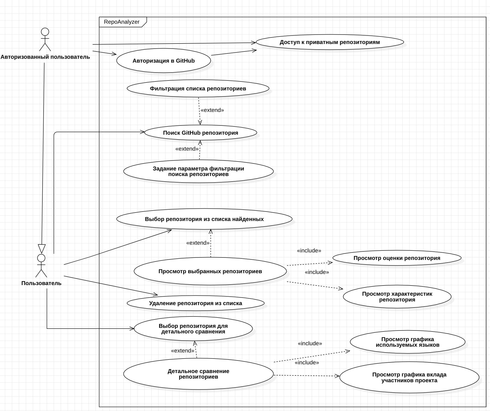
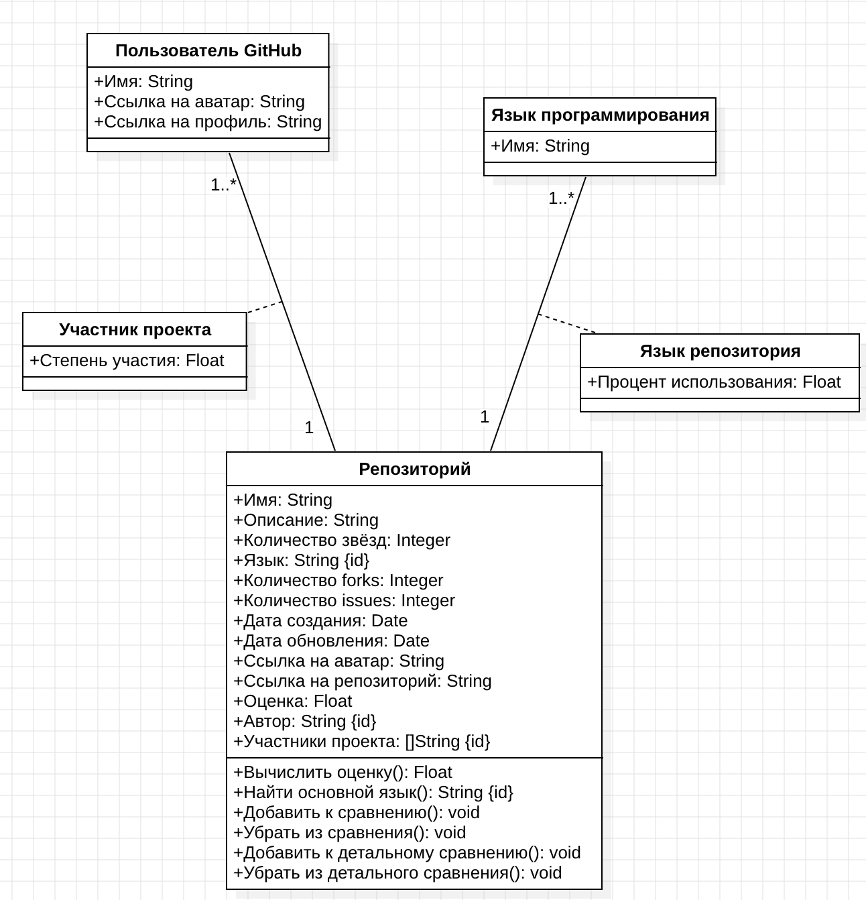
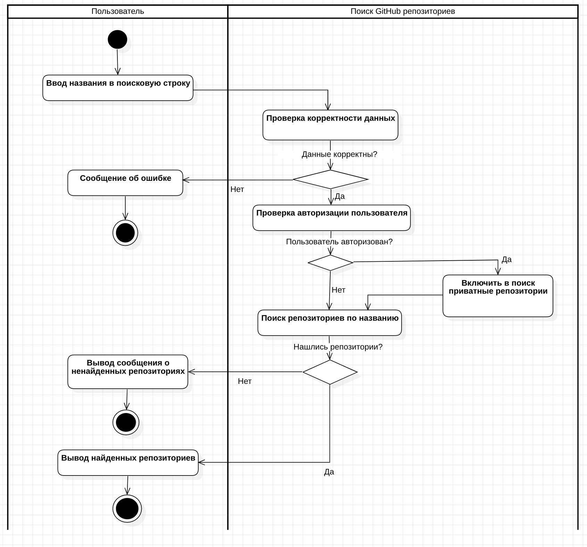

# Отчёт Пакало А.С. ИУ5-12М по лабораторной работе № 4

## Прототип пользовательского интерфейса

## Диаграмма прецедентов

## Диаграмма классов

## Диаграмма активностей

## Функциональные требования
Проект "RepoAnalyzer" должен выполнять следующие функциональные требования:
1. Поиск GitHub репозиториев с возможностью фильтрации.
2. Выбор репозитория из списка найденных.
3. Просмотр статистики:
    - название,
    - описание,
    - количество звёзд,
    - количество forks,
    - количество issues,
    - основной язык,
    - дата создания и последнего обновления,
    - аватар репозитория,
    - имя автора,
    - аватар автора.
4. Просмотр оценки репозитория.
5. Возможность детального сравнения с визуализацией:
    - по используемым языкам,
    - по активности участников проекта.
6. Доступ к приватным репозиториям при авторизации через GitHub.

## Нефункциональные требования
Проект "RepoAnalyzer" должен выполнять следующие нефункциональные требования:
- Дизайн должен быть похож на дизайн GitHub.
- Программа должна быть реализована в браузере.
- Алгоритм оценки должен быть реализован с использованием большой языковой модели.

## Спецификация прецедентов
Описание основных прецедентов для АСУ "Repo Analyzer":
### 1. Просмотр выбранных репозиториев
**Предусловие:**

Найдены и выбраны из списка репозитория для сравнения.

**Главный поток:**

На сервер посылается запрос для вычисления объективной оценки
проекта. Полученная оценка и основная статистика отображается в удобном для
восприятия виде.

**Последовательность действий:**
1. Запрос к базе данных.
2. Просмотр основных характеристик для выбранных репозиториев.
3. Просмотр объективной оценки для выбранных из репозиториев.

**Альтернативные потоки:**

Если пользователь не выбрал после поиска ни одного репозитория, ему
отображается сообщение с просьбой найти нужные проекты.

### 2. Детальное сравнение репозиториев
**Предусловие:**

Выбраны репозитории для детального сравнения.

**Главный поток:**

Пользователь получает возможность просмотреть детальную информацию о каждом из
выбранных репозиториев. Сравнить их друг с другом.

**Последовательность действий:**
1. Просмотр графика используемых языков для каждого из репозиториев.
2. Просмотр графика вклада участников проекта для каждого из репозиториев.

**Альтернативные потоки:**

Если пользователь не выбрал репозитории для детального сравнения у него будут
доступны для просмотра только краткая статистика каждого из проектов, а также
объективная оценка по каждому из них.
