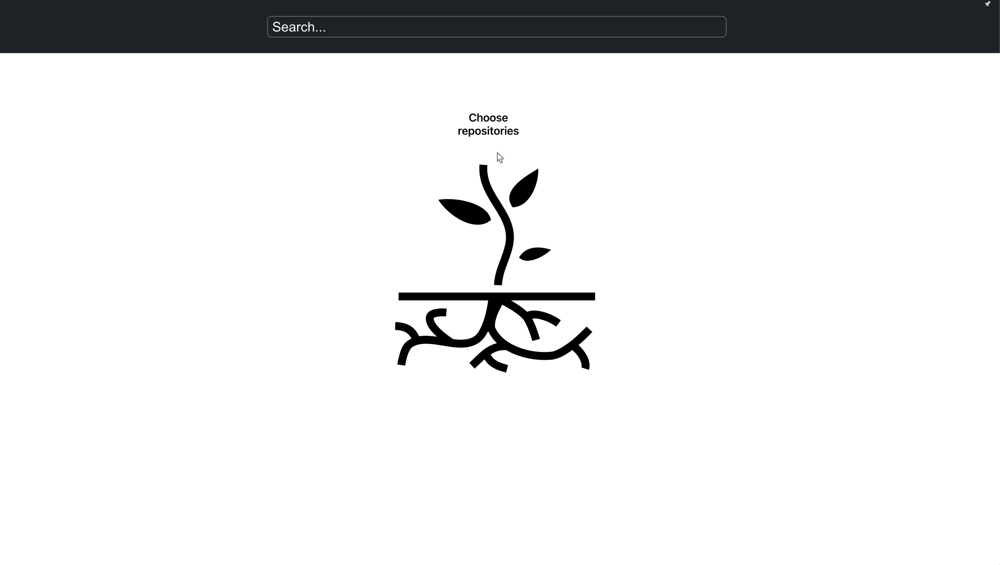
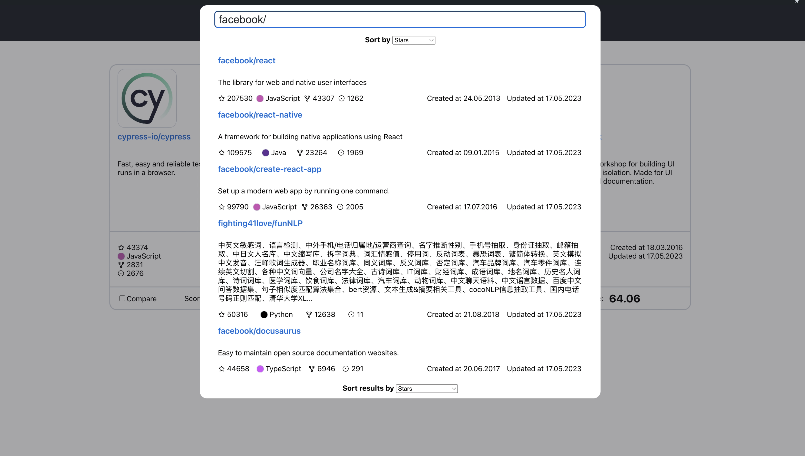
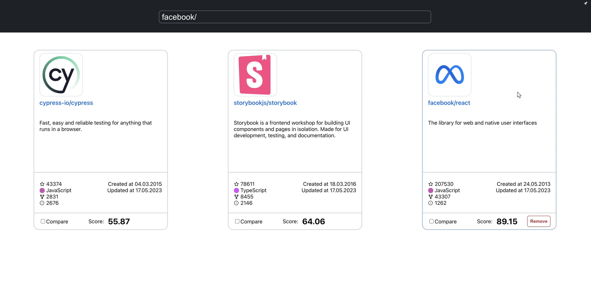
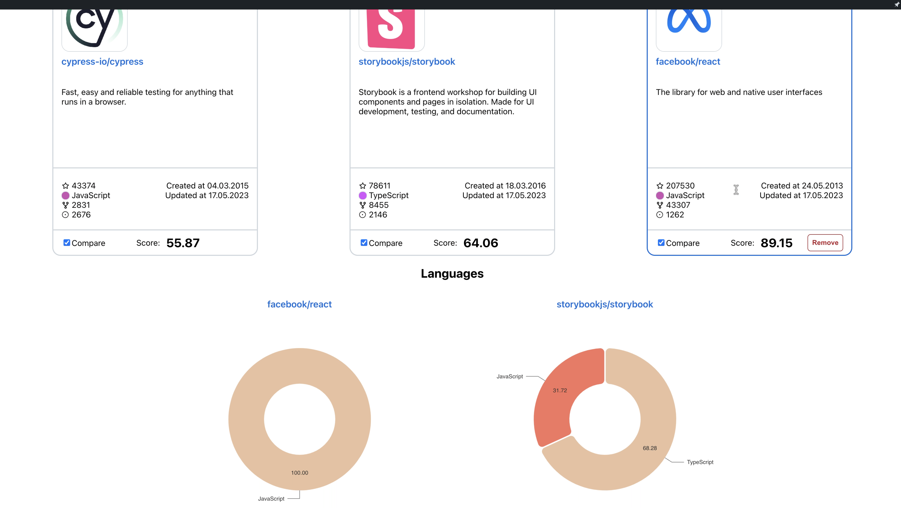
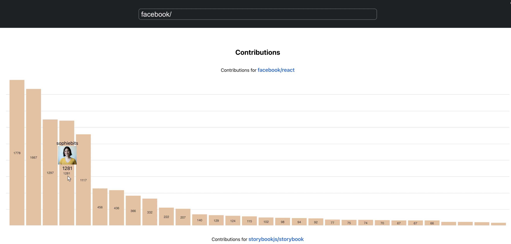
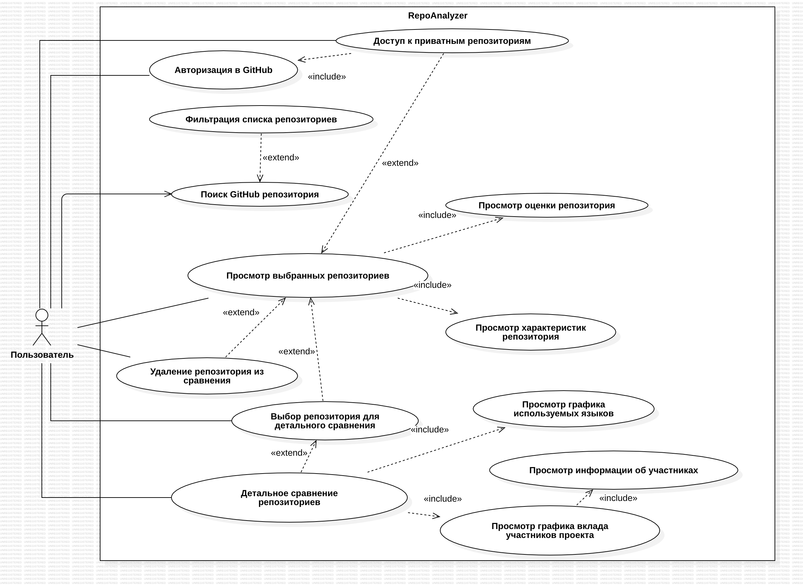
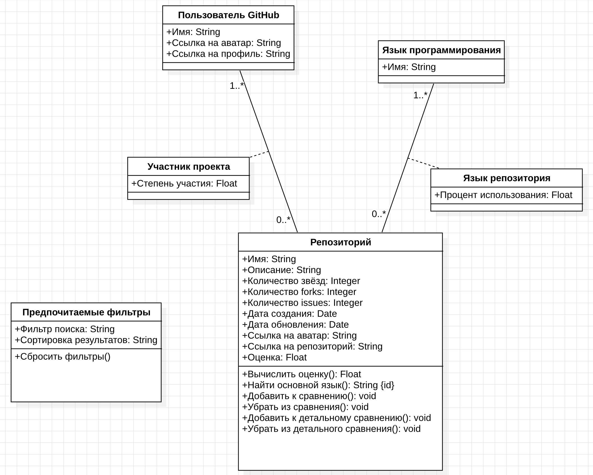
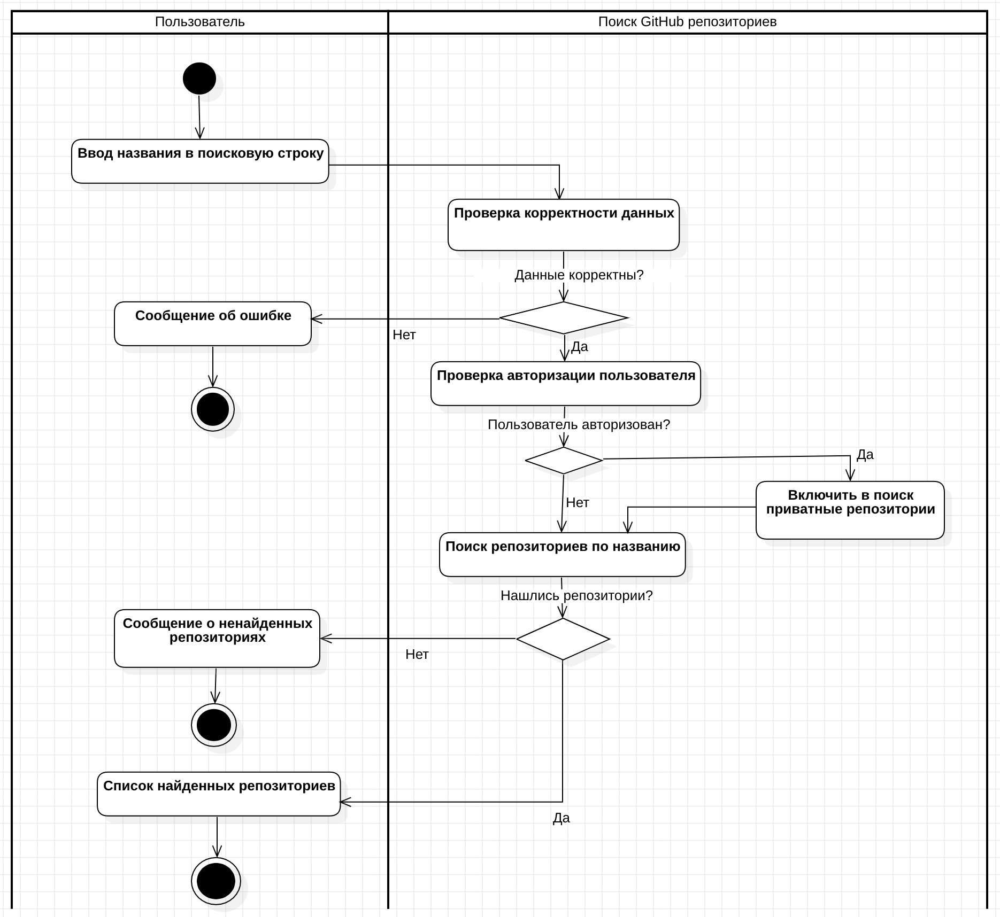

# Отчёт Пакало А.С. ИУ5-12М по лабораторной работе № 4

## Прототип пользовательского интерфейса
Начальная страница, состояние приложения при нуле найденных репозиториев:

Поиск и просмотр найденных репозиториев:

Сравнение репозиториев:

Детальное сравнение репозиториев:

## Диаграмма прецедентов

## Диаграмма классов

## Диаграмма активностей

## Функциональные требования
Проект "RepoAnalyzer" должен выполнять следующие функциональные требования:
1. Поиск GitHub репозиториев с возможностью фильтрации.
2. Выбор репозитория из списка найденных.
3. Просмотр статистики:
    - название,
    - описание,
    - количество звёзд,
    - количество forks,
    - количество issues,
    - основной язык,
    - дата создания и последнего обновления,
    - аватар репозитория,
    - имя автора,
    - аватар автора.
4. Просмотр оценки репозитория.
5. Возможность детального сравнения с визуализацией:
    - по используемым языкам,
    - по активности участников проекта.
6. Доступ к приватным репозиториям при авторизации через GitHub.

## Нефункциональные требования
Проект "RepoAnalyzer" должен выполнять следующие нефункциональные требования:
- Дизайн должен быть похож на дизайн GitHub.
- Программа должна быть реализована в браузере.
- Алгоритм оценки должен быть реализован с использованием большой языковой модели.

## Спецификация прецедентов
Описание основных прецедентов для АСУ "Repo Analyzer":
### 1. Просмотр выбранных репозиториев
**Предусловие:**

Найдены и выбраны из списка репозитории для сравнения.

**Главный поток:**

На сервер посылается запрос для получения характеристик репозитория и 
вычисления объективной оценки проекта.
Полученная оценка и основная статистика отображается в удобном для
восприятия виде.

**Последовательность действий:**
1. Запрос к базе данных.
2. Вычисление объективной оценки.
3. Просмотр основных характеристик для выбранных репозиториев.
4. Просмотр объективной оценки для выбранных из репозиториев.

**Постусловие:**

Пользователь получил возможность сравнить между собой репозитории,
принимая во внимание статистику и оценку.

**Альтернативные потоки:**

Если пользователь не выбрал после поиска ни одного репозитория, ему
отображается сообщение с просьбой найти нужные проекты.

### 2. Детальное сравнение репозиториев
**Предусловие:**

Выбраны репозитории для детального сравнения.

**Главный поток:**

Пользователь получает возможность просмотреть детальную информацию о каждом из
выбранных репозиториев, возможность сравнить их друг с другом.

**Последовательность действий:**
1. Запрос к базе данных с языками, используемыми внутри
   репозиториев; вычисление процентного соотношения.
2. Отрисовка диаграммы-пирога (англ. pie-chart) языков.
3. Запрос к базе данных с участниками проекта.
4. Отрисовка столбчатой диаграммы вклада участников проекта.
5. Просмотр диаграммы используемых языков для каждого из репозиториев.
6. Просмотр графика вклада участников проекта для каждого из репозиториев.

**Постусловие:**

Пользователь получил возможность сравнить между собой репозитории более
детально за счёт визуализированной статистики.

**Альтернативные потоки:**

Если пользователь не выбрал репозитории для детального сравнения у него будут
доступны для просмотра только краткая статистика каждого из проектов, а также
объективная оценка по каждому из них.
